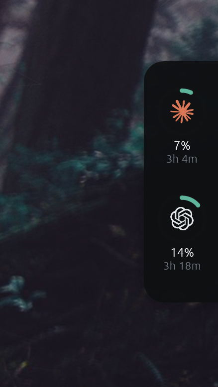
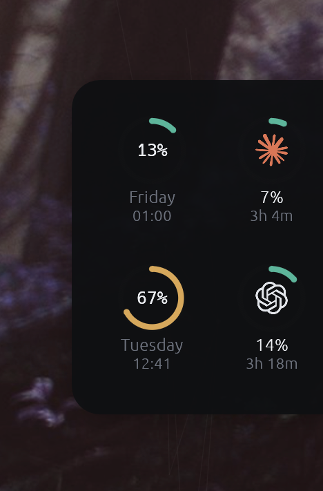

<div align="center">


**A lightweight, always-on-top dock showing how much Claude and Codex quota you have left.**

[](https://github.com/haakofli/usage-tracker/releases/latest)


[](LICENSE)




</div>

## Features

- **A ring per provider** — Claude and Codex, 5-hour window, with the time until it resets.
- **Hover for the week** — the weekly ring slides out alongside. The 5-hour rings never move, so opening the panel adds information rather than rearranging it.
- **Colour tracks usage** — teal under 50%, amber to 80%, rose above.
- **Out of the way** — attaches to a screen edge, passes clicks through outside the card, and keeps off the taskbar.
- **Small** — an 11 MB binary holding 117 MB resident, measured on Windows. No async runtime.
- **Remembers** — screen, edge, size and provider choice survive a restart.

## Install

Download above and run it — there is no installer, and nothing to trust beyond the binary itself. Or build it yourself:

```sh
git clone https://github.com/haakofli/usage-tracker
cd usage-tracker
cargo build --release
```

The binary lands in `target/release/`. Put it wherever you like; to have it come back after a reboot, tick **Start at login** in its menu — the app registers itself and unregisters just as easily.

> **Downloads are unsigned.** SmartScreen warns on first run; macOS needs
> `xattr -d com.apple.quarantine usage-tracker-macos`. This app reads your Claude
> OAuth token, which is a fair reason to prefer building it yourself.

> **macOS support is new.** It builds and is tested in CI on every commit, but it
> has had far less real-world use than the Windows build. Issues welcome.

## Using it

| | |
| --- | --- |
| See weekly quota | Hover the dock |
| Move it | Drag it — it attaches to whichever screen edge you release it near |
| Resize | Hover, then <kbd>Ctrl</kbd>/<kbd>⌘</kbd> with <kbd>+</kbd>, <kbd>−</kbd> or <kbd>0</kbd> |
| Choose providers | Tray or menu bar icon, or right-click the dock |
| Start at login | Tick **Start at login** in either menu |
| Refresh, switch edge, quit | Right-click the dock |

## Where the numbers come from

**Claude** — `GET /api/oauth/usage`, authorised with the token in `~/.claude/.credentials.json`. That file is **only ever read, never written**.

**Codex** — the `rate_limits` snapshot Codex already writes into `~/.codex/sessions/**/rollout-*.jsonl`. No subprocess, and it cannot be rate limited, but it is only as fresh as your last Codex request.

Copilot, Gemini and Cursor are detected and listed, but publish no quota you can read locally, so they appear greyed out rather than as empty rings.

Polling intervals, rate-limit backoff and caching are covered in [docs/how-it-works.md](docs/how-it-works.md).

## Build

```sh
cargo run              # run it
cargo test             # the test suite
cargo run -- --probe   # print raw provider responses once, for diagnosis
```

Rust and `eframe`/`egui` on the `glow` backend. A background thread polls each provider and publishes an immutable snapshot through a mutex; the render loop only reads that snapshot.

## License

[MIT](LICENSE) — free for any use.

Provider marks are the trademarks of their respective owners, included to label their own quota: `assets/claude.svg` from [simple-icons](https://github.com/simple-icons/simple-icons) (CC0), `assets/codex.svg` from [gilbarbara/logos](https://github.com/gilbarbara/logos).
